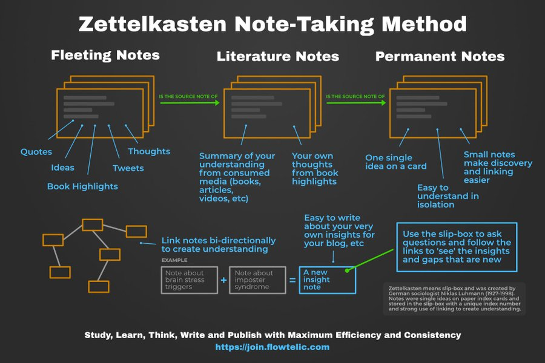

# Zettelkasten using Obsidian
Created : 08-02-2022 21:36

### Step 1: Fleeting Notes
Rough scribbles, Sticky Notes, Google Keep, Notepad

### Step2: Literature Notes
Insights when reading fleeting notes

### Step3: Permanent Notes
When working on a project, draw conclusions

* Fleeting Notes: Capture it quick.
* Literature Notes: Organised thoughts based on Fleeting Notes.
* Permanent Notes: Insights, that can be linked with other thoughts.
* Permanent Notes follow a Map of content, and is usually organised around a project.
* Provide backlinks to topics that make up the project.
* Backlinks can trigger creation of new Map Of Content Pages.
* Templates: Help automate new note creation.
* References: Collect/Track sources.
* Creating a digital version often reffered to as the Second Brain.

## References
1. [https://www.youtube.com/watch?v=ziE6UExsOrs](https://www.youtube.com/watch?v=ziE6UExsOrs)